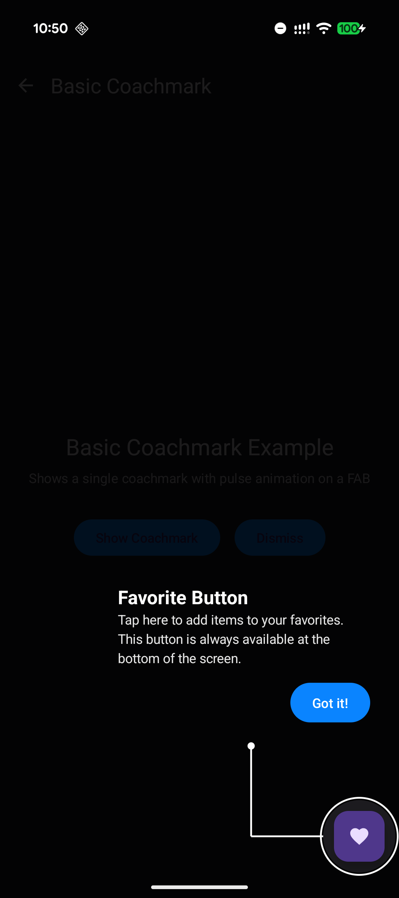
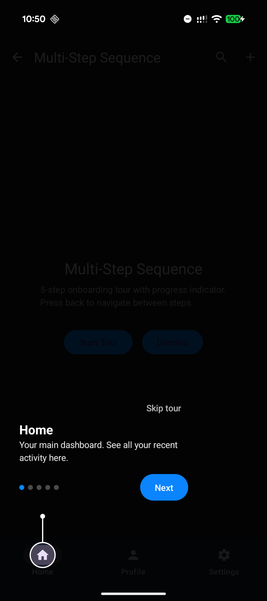
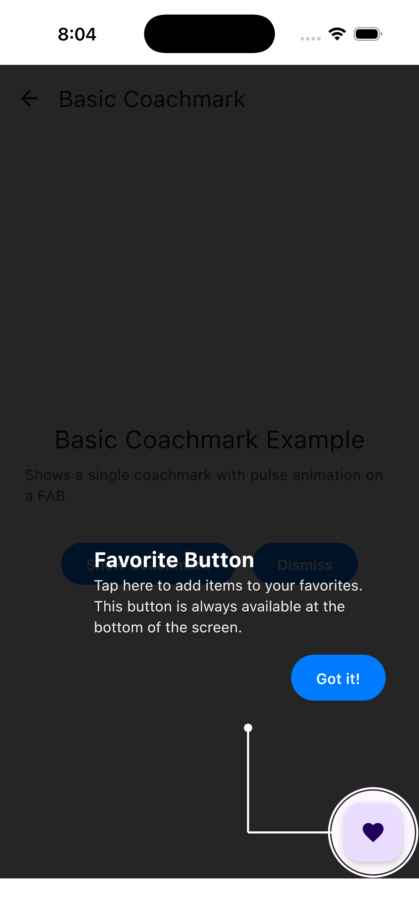

# Lumen

<p align="center">
  
</p>

<p align="center">
  <strong>Spotlight your UI, not a screenshot of it.</strong>
</p>

<p align="center">
  <a href="https://central.sonatype.com/artifact/io.github.aldefy/lumen"></a>
  <a href="https://kotlinlang.org"></a>
  <a href="https://www.jetbrains.com/compose-multiplatform/"></a>
  <a href="LICENSE"></a>
  <a href="https://aldefy.github.io/Lumen/"></a>
  <a href="https://aldefy.github.io/Lumen/demo/"></a>
  <a href="https://aldefy.github.io/Lumen/dashboard/"></a>
  
  
  
  
</p>

---

A Compose Multiplatform coachmark library that creates **true transparent cutouts** in the overlay scrim. Your actual UI remains visible and interactive through the spotlight - animations play, buttons respond, nothing is faked.

> **Supports Android, iOS, Desktop, and Web** via Kotlin Multiplatform.

**[Live Demo](https://aldefy.github.io/Lumen/demo/)** | **[Dashboard Demo](https://aldefy.github.io/Lumen/dashboard/)** — Try it in your browser, no install required.

## Installation

### Kotlin Multiplatform

Add to your shared module's `build.gradle.kts`:

```kotlin
kotlin {
    sourceSets {
        commonMain.dependencies {
            implementation("io.github.aldefy:lumen:1.0.0-beta05")
        }
    }
}
```

This resolves the correct artifact per target automatically:

| Target | Artifact |
|--------|----------|
| Android | `lumen-android` (AAR) |
| iOS arm64 | `lumen-iosarm64` (klib) |
| iOS Simulator arm64 | `lumen-iossimulatorarm64` (klib) |
| iOS Simulator x64 | `lumen-iosx64` (klib) |
| Desktop (JVM) | `lumen-jvm` (JAR) |
| Web (Wasm) | `lumen-wasmjs` (klib) |

### Android Only

If your project is not using KMP:

```kotlin
dependencies {
    implementation("io.github.aldefy:lumen-android:1.0.0-beta05")
}
```

## Usage

```kotlin
val controller = rememberCoachmarkController()

CoachmarkHost(controller = controller) {
    // Your screen content
    Button(
        onClick = { },
        modifier = Modifier.coachmarkTarget(controller, "my-button")
    ) {
        Text("Click me")
    }
}

// Show the coachmark
controller.show(
    CoachmarkTarget(
        id = "my-button",
        title = "Welcome",
        description = "Tap here to get started.",
    )
)
```

## Demo

<p align="center">
  
  &nbsp;&nbsp;&nbsp;&nbsp;
  
</p>

<p align="center">
  <em>Single coachmark with pulse animation</em>
  &nbsp;&nbsp;&nbsp;&nbsp;&nbsp;&nbsp;&nbsp;&nbsp;&nbsp;&nbsp;&nbsp;&nbsp;&nbsp;&nbsp;
  <em>Multi-step onboarding tour</em>
</p>

## [API Reference](https://aldefy.github.io/Lumen/#/api-reference)

> For the full API documentation, visit the [docs site](https://aldefy.github.io/Lumen/#/api-reference).

### Core Components

| Component | Description |
|-----------|-------------|
| `CoachmarkHost` | Wraps your content and renders the overlay scrim |
| `CoachmarkController` | Manages coachmark state, show/dismiss operations |
| `CoachmarkTarget` | Defines a single spotlight target with tooltip content |
| `Modifier.coachmarkTarget()` | Tags a composable as a coachmark target |

### CoachmarkTarget Properties

| Property | Type | Description |
|----------|------|-------------|
| `id` | `String` | Unique identifier for the target |
| `title` | `String` | Tooltip headline |
| `description` | `String` | Tooltip body text |
| `shape` | `CutoutShape` | Shape of the transparent cutout |
| `tooltipPosition` | `TooltipPosition` | Where tooltip appears relative to target |
| `connectorStyle` | `ConnectorStyle` | Style of line connecting cutout to tooltip |
| `connectorEndStyle` | `ConnectorEndStyle` | Endpoint decoration (DOT, ARROW, NONE, CUSTOM) |
| `highlightAnimation` | `HighlightAnimation` | Animation effect on the cutout |
| `targetTapBehavior` | `TargetTapBehavior` | What happens when user taps the cutout area |
| `showDontShowAgain` | `Boolean` | Show "Don't show again" checkbox |
| `ctaText` | `String` | Call-to-action button text |

### CutoutShape

| Shape | Description |
|-------|-------------|
| `Circle` | Circular cutout, ideal for FABs and icons |
| `Rect` | Rectangular cutout with sharp corners |
| `RoundedRect` | Rectangle with rounded corners |
| `Squircle` | iOS-style superellipse with smooth curves |
| `Star` | Star shape for gamification highlights |

### HighlightAnimation

| Animation | Description |
|-----------|-------------|
| `NONE` | Static cutout, no animation |
| `PULSE` | Gentle breathing/scaling effect |
| `GLOW` | Pulsing stroke width and opacity |
| `RIPPLE` | Expanding rings emanating outward |
| `SHIMMER` | Highlight sweeping around the stroke |
| `BOUNCE` | Energetic scale with overshoot |

### ConnectorStyle

| Style | Description |
|-------|-------------|
| `AUTO` | Auto-select based on tooltip position |
| `VERTICAL` | Straight vertical line |
| `HORIZONTAL` | Straight horizontal line |
| `ELBOW` | L-shaped with 90° bend |
| `DIRECT` | Diagonal line pointing to tooltip |
| `CURVED` | Smooth quadratic Bezier curve |

### ConnectorEndStyle

| Style | Description |
|-------|-------------|
| `DOT` | Small filled circle (default) |
| `ARROW` | Directional arrowhead toward tooltip |
| `NONE` | No endpoint decoration |
| `CUSTOM` | Custom rendering via `DrawScope` lambda |

### CoachmarkConfig

| Property | Default | Description |
|----------|---------|-------------|
| `scrimOpacity` | `MEDIUM` | Darkness of the overlay (LIGHT, MEDIUM, DARK, EXTRA_DARK) |
| `scrimTapBehavior` | `DISMISS` | Action when tapping outside cutout |
| `backPressBehavior` | `DISMISS` | Action on back press |
| `showSkipButton` | `false` | Show skip button in tooltip |
| `showProgressIndicator` | `true` | Show step dots for sequences |
| `delayBeforeShow` | `0L` | Milliseconds to wait before showing |
| `connectorCutoutGap` | `12.dp` | Minimum gap between cutout animation edge and connector dot |
| `ctaMinWidth` | `Dp.Unspecified` | Minimum width for the CTA button (unspecified = wrap content) |
| `ctaMinHeight` | `48.dp` | Minimum height for the CTA button |
| `ctaCornerRadius` | `22.dp` | Corner radius for the CTA button shape |

### Controller Methods

```kotlin
controller.show(target)           // Show single coachmark
controller.showSequence(targets)  // Show multi-step tour
controller.next()                 // Advance to next step
controller.previous()             // Go back one step
controller.dismiss()              // Hide coachmark
controller.enabled = false        // Disable all coachmarks
```

## Sample Apps

### Feature Catalog (`sample`)

A Compose Multiplatform app with interactive demos for all features.

- **Android:** Open the project in Android Studio and run the `sample` configuration.
- **iOS:** Open `iosApp/iosApp.xcodeproj` in Xcode and run on a simulator or device.
- **Desktop:** Run `./gradlew :sample:run` from the terminal to launch the desktop window.
- **Web:** Run `./gradlew :sample:wasmJsBrowserRun` to open the sample in a browser.

<p align="center">
  
</p>

### Analytics Dashboard (`sample-web`)

A web-only (wasmJs) dashboard demo showing Lumen coachmarks in a real-world SaaS onboarding scenario. Features a 7-step auto-starting feature tour with varied cutout shapes, animations, and connector styles.

- **Web:** Run `./gradlew :sample-web:wasmJsBrowserDevelopmentRun` to open the dashboard in a browser.
- **[Live Dashboard Demo](https://aldefy.github.io/Lumen/dashboard/)**

## Platform Support

| Platform | Min Version | Artifact |
|----------|-------------|----------|
| Android  | API 23      | `lumen` (via Gradle metadata) or `lumen-android` |
| iOS arm64 | iOS 16     | `lumen-iosarm64` |
| iOS Simulator arm64 | iOS 16 | `lumen-iossimulatorarm64` |
| iOS Simulator x64   | iOS 16 | `lumen-iosx64` |
| Desktop (JVM) | JDK 17 | `lumen-jvm` |
| Web (Wasm) | Modern browser | `lumen-wasmjs` |

## Requirements

- Kotlin 2.0+
- Compose Multiplatform 1.7+
- Android API 23+ / iOS 16+ / JDK 17+ / Modern browsers (Chrome, Firefox, Safari)

## License

```
Copyright 2024 Adit Lal

Licensed under the Apache License, Version 2.0
```
